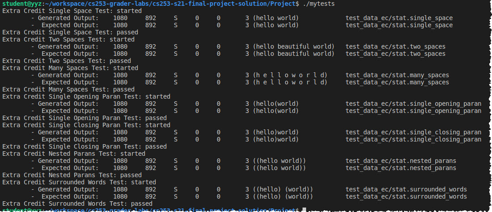

# Extra Credit Opportunity
It is valid for the comm field in the stat file to contain spaces and parantheses which means each of the following are valid comm values.
- (helloworld)
- (hello world)
- (hello) (world)  

For 25 points extra credit, modify your implementation to successfully parse commands that contain spaces and parantheses from the stat file. There are LOTS of different permutations for comm and your code must handle them all! :) To receive this extra credit your solution must successfully complete the test cases described below.

## Test cases and data for extra credit
Please extract the [test_data_ec.tgz](test_data_ec.tgz) into your project directory and then run the test cases provided in [mytests.c](mytests.c) against your project implementation.  I developed these 7 test cases while testing my own implementation and I will use them to evaluate the correctness of your implementation. Each test displays **passed** if it is able to execute without runtime errors, however you will need to visually compare the output generated by your implementation against the expected output to confirm correctness. 

